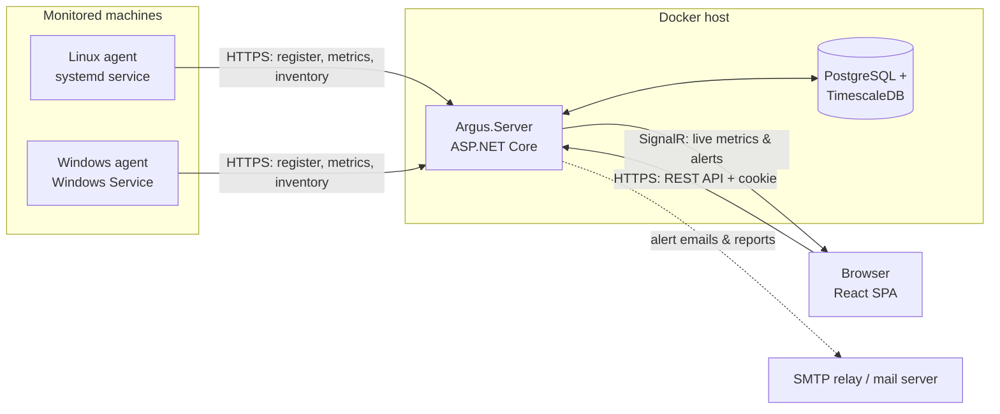

# Architecture

Argus has three moving parts: **agents** that run on monitored machines, a **server** that stores
and analyses what the agents report, and a **web UI** that the server hosts.



## Components

### Agent (`src/Argus.Agent`)

A .NET worker service published as a self-contained, single-file executable for `linux-x64`,
`linux-arm64` and `win-x64`. It runs as a systemd unit on Linux and as a Windows Service on Windows.

- **Collectors** sample CPU, memory, swap, load, filesystems, disk IO, network interfaces,
  processes and system inventory. Each OS has its own implementation behind a shared interface
  (`/proc` on Linux, Win32 APIs on Windows).
- **Enrollment**: on first start the agent exchanges a one-time **enrollment token** (created in
  the UI) for a **host id + agent key**, which it stores in a state file readable only by the
  service account.
- **Transport**: samples are buffered in a bounded in-memory queue and posted in batches. If the
  server is unreachable the agent keeps buffering and retries with exponential backoff, so short
  outages do not lose data. Responses can carry settings (e.g. collection interval) from the server.

### Server (`src/Argus.Server`)

An ASP.NET Core application using Minimal APIs, organised by feature folder.

| Feature | Responsibility |
| --- | --- |
| Auth | ASP.NET Core Identity, cookie sessions, first-run setup, user management |
| Enrollment | Enrollment tokens, agent registration, agent key authentication |
| Ingest | Validates metric batches and bulk-inserts them into TimescaleDB |
| Hosts / Metrics | Host inventory, status, time-series queries with automatic downsampling |
| Alerts | Alert rules, background evaluator, alert lifecycle (firing → resolved) |
| Live | SignalR hub pushing fresh metrics, host status and alerts to browsers |
| Notifications | Email (SMTP) and webhook delivery of alerts and scheduled reports |

The server also serves the compiled web UI from `wwwroot` and the agent install scripts/binaries
under `/downloads`.

### Web UI (`web/`)

A React + TypeScript single-page app built with Vite. It talks to the server's `/api` endpoints
using the auth cookie and receives live updates over SignalR (`/hubs/live`). In development the
Vite dev server proxies `/api` and `/hubs` to the ASP.NET Core server.

### Shared contracts (`src/Argus.Contracts`)

DTOs for the agent ↔ server protocol plus a source-generated `JsonSerializerContext`, referenced
by both the agent and the server so the wire format cannot drift.

## Data flow

1. A user creates an **enrollment token** in the UI and runs the displayed install command on a
   machine.
2. The agent calls `POST /api/agent/v1/register` with the token, machine id and system inventory.
   The server creates (or re-links) a **host** owned by the token's user and returns an agent key.
   Only the SHA-256 hash of the key is stored.
3. Every collection interval (default 15 s) the agent posts a batch to `POST /api/agent/v1/metrics`
   authenticated with its key. Ingestion is idempotent: re-sent samples are ignored.
4. The server writes samples to hypertables, updates the host's *last seen* time and pushes a
   snapshot to the owner's browsers over SignalR.
5. The **alert evaluator** runs periodically, checks each enabled rule against recent data and
   opens or resolves **alerts**. State changes are pushed to the UI and handed to the notification
   dispatcher.
6. Dashboards query time series through the metrics API, which picks raw data or a continuous
   aggregate depending on the requested range.

## Data model

Relational tables (managed by EF Core migrations):

| Table | Purpose |
| --- | --- |
| `users`, `roles`, … | ASP.NET Core Identity |
| `hosts` | Monitored machines: owner, display name, inventory, tags, last seen, agent key hash |
| `enrollment_tokens` | Hashed tokens with expiry, usage limits and revocation |
| `alert_rules` | Metric, operator, threshold, duration, severity, scope |
| `alerts` | Alert instances: rule, host, resource, status, values, acknowledgement |
| `host_processes` | Latest top-process snapshot per host |
| `data_protection_keys` | ASP.NET Core data protection key ring (cookie encryption) |

Time-series tables (TimescaleDB hypertables, created with SQL in migrations):

| Table | Key | Contents |
| --- | --- | --- |
| `host_metrics` | `(host_id, time)` | CPU, memory, swap, load, aggregate disk IO & network, processes, uptime |
| `filesystem_metrics` | `(host_id, mount_point, time)` | Size, used, free, inode usage per filesystem |
| `network_metrics` | `(host_id, interface, time)` | Per-interface throughput and errors |

Rollups: `host_metrics_5m` and `host_metrics_1h` continuous aggregates (avg / max per bucket).
Raw data is compressed after a day and dropped after a configurable retention period; rollups
are kept longer.

## Security model

- **Users** authenticate with email + password (ASP.NET Core Identity, PBKDF2 hashing, lockout).
  The session is an encrypted HttpOnly, `SameSite=Strict` cookie.
- **CSRF**: state-changing API calls made with the cookie must carry a custom request header,
  which browsers cannot add cross-origin without a CORS preflight (and CORS is not enabled).
- **Agents** authenticate with a per-host random key sent as a bearer token. Keys and enrollment
  tokens are 256-bit random values; only their SHA-256 hashes are stored.
- **Authorization**: users only see hosts they own; the `Admin` role sees all hosts and manages users.
- Auth and agent endpoints are rate limited; request bodies are size limited.
- TLS is terminated by a reverse proxy (optional Caddy service in the compose file).

## Deployment

`docker compose` runs two containers — `argus` (server + UI + agent downloads) and `db`
(TimescaleDB) — plus an optional `caddy` reverse proxy for automatic HTTPS. The server applies
database migrations on startup. See [deployment.md](deployment.md).

## Repository layout

```
src/
  Argus.Contracts/   shared agent ↔ server DTOs
  Argus.Server/      ASP.NET Core API, background services, SPA host
  Argus.Agent/       cross-platform monitoring agent
tests/
  Argus.Server.Tests/
  Argus.Agent.Tests/
web/                 React + TypeScript UI
deploy/              docker compose files, agent install scripts, systemd unit
docs/                documentation
```
